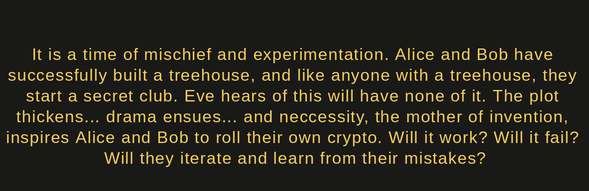
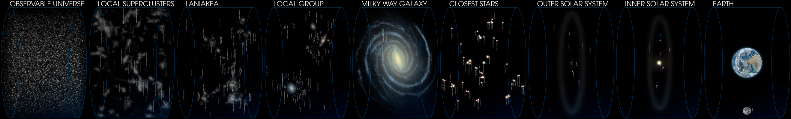

  
  
  
  

   

### An Inconvenient Truth
- this book is a WIP and as such is incomplete and inaccurate
- please refer to [Rusty Cryptoeconomics](https://burrrata.github.io/rusty_cryptoeconomics/intro.html) for the time being

   

## [A New Club](a_new_club.md)
Alice and Bob build a treehouse. Like anyone with a treehouse they started a secret club! Eve wants to unmask their passphrase though so they create an elaborate code to keep it secret.

 

## [Eve Strikes Back](eve_strikes_back.md)
Eve uses cryptanalysis to unscramble the messages and decrypt Alice and Bob's codes and passphrase. Everyone knows and the club is in shambles! What to do?!

 

## [Return of the Code](return_of_the_code.md)
Thrwarted by Eve, Alice and Bob hunker down in the playground and come up with new ideas, and find new hope. Will they finally be able to create thier club? Will this become even more useful than they thought?! We will find out... 

 
